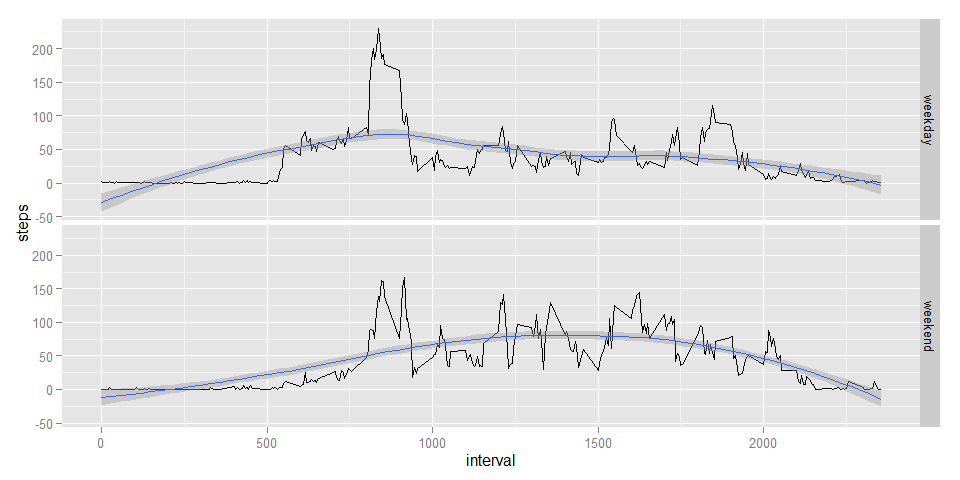

# Reproducible Research: Peer Assessment 1

## Loading and preprocessing the data

#### 1. Load the data (i.e. read.csv())
#### 2. Process/transform the data (if necessary) into a format suitable for your analysis
The ```dbplyr``` and ```lubridate``` libraries are used to load and process the data, so these libraries are made available.

```r
library(dplyr)
library(lubridate)
```
A standard call to ```read.csv``` loads the file.  Then a call to ```mutate``` uses a ```lubridate``` function to add a combined ```dateAndTime``` column.  Also a column is added that contains ```dateAndTime``` plus five minutes, to be used later.  Finally a call to ```arrange``` sorts the table by the column ```dateAndTime```.

```r
activity <-
  read.csv("activity.csv") %>%
  mutate(
    dateAndTime = ymd_hm(paste(date,sprintf("%04d", interval), " ")),
    dateAndTimePlus5 = dateAndTime + minutes(5)
    ) %>%
  arrange(dateAndTime)
```

## What is mean total number of steps taken per day?

#### 1. Calculate the total number of steps taken per day
Functions in ```dplyr``` are used to compute the total steps per day, exclusive of ```NA``` values.

```r
totalStepsByDay <- 
  activity[!is.na(activity$steps),] %>%
  group_by(date) %>% 
  summarize(steps=sum(steps))
```

#### 2. Make a histogram of the total number of steps taken each day
This histogram shows the number of steps per day.  Because of the relatively small number of days and the large range of data, the default bin count has been changed from 30 to 16.

```r
library(ggplot2)
totalStepsByDay %>%
  qplot(steps, data=., binwidth = 21153/16)
```

 

#### 3. Calculate and report the mean and median of the total number of steps taken per day

```r
as.data.frame(
  totalStepsByDay %>% 
  summarize(
    mean=mean(steps),
    median=median(steps)))
```

```
##       mean median
## 1 10766.19  10765
```

## What is the average daily activity pattern?

#### 1. Make a time series plot (i.e. type = "l") of the 5-minute interval (x-axis) and the average number of steps taken, averaged across all days (y-axis)
The average number of steps by time interval (exclusive of ```NA``` values) is computed and stored in ```dap```.  The line plot is shown below.

```r
dap <- 
  activity[!is.na(activity$steps),] %>%
  group_by(interval) %>% 
  summarize(steps=mean(steps))
qplot(interval,steps,data=dap, geom="line") + geom_smooth()
```

 

#### 2. Which 5-minute interval, on average across all the days in the dataset, contains the maximum number of steps?
This expression displays the interval corresponding to the maximum average number of steps accross all days and displays it as a scalar.

```r
as.data.frame(
  dap[which(dap$steps == max(dap$steps)),1])[1,1]
```

```
## [1] 835
```

## Imputing missing values
#### 1. Calculate and report the total number of missing values in the dataset (i.e. the total number of rows with NAs)

Normally we focus on  missing values in a dataset's non-key columns.
Here missing values are counted in the ```steps``` column.

```r
sum(is.na(activity$steps))
```

```
## [1] 2304
```

Although it is unlikely that key columns have ```NA``` values, it is important to  rule out the possibility.  Now the ```date``` and ```interval``` columns are tested for     ```NA``` values.

```r
sum(is.na(activity$date)) + sum(is.na(activity$interval))
```

```
## [1] 0
```
Thus, we can see that only the ```steps``` column has any missing values.

A subtler form of "missing" values is the failure for an expected row to appear.  If one or more of the five-minute time intervals were omitted from the dataset, some missing value imputation strategies could be affected.  To check this the following code counts the number of  ```dateAndTime``` values that are not equal to the prior value plus five minutes.  As a corrolary of this validation, we also confirm there are no duplicated intervals.

```r
sum(
  activity$dateAndTimePlus5[1:(nrow(activity)-1)]
  !=activity$dateAndTime[2:nrow(activity)])
```

```
## [1] 0
```

#### 2. Devise a strategy for filling in all of the missing values in the dataset. The strategy does not need to be sophisticated.
A two-stage process is used to impute missing values.  First, the average number of steps by interval, is interpolated to all possible intervals.  Second, the missings values in the original data set are replaced by the interpolated average number of steps by interval.

#### 3. Create a new dataset that is equal to the original dataset but with the missing data filled in.
Below ```activityNoNA``` is created with the strategy described in section 2.

```r
allIntervals<-as.data.frame(seq(from = 0,to = 2355,by = 5))
colnames(allIntervals)<-c("interval")
dapAll <- merge(dap,allIntervals,all=TRUE)
library(zoo)
dapAllZ <- zoo(dapAll)
index(dapAllZ) <- dapAllZ[,1]
dapAllZ_approx <- na.approx(dapAllZ)
dapNew <- as.data.frame(dapAllZ_approx)
naIntervals <- activity[is.na(activity$steps),3]
activityNoNA <- activity
activityNoNA[is.na(activity$steps),1]<-dapNew[dapNew$interval %in% naIntervals,2]
```

#### 4. Make a histogram of the total number of steps taken each day and Calculate and report the mean and median total number of steps taken per day. Do these values differ from the estimates from the first part of the assignment? What is the impact of imputing missing data on the estimates of the total daily number of steps?
Below, the number of histogram of steps, including imputed values, is developed and shown.  As expected due to the imputation strategy, the distribution has a similar shape to that of the raw distribution.

```r
totalStepsByDayNoNA <- 
  activityNoNA %>%
  group_by(date) %>% 
  summarize(steps=sum(steps))
totalStepsByDayNoNA %>%
  qplot(steps, data=., binwidth = 21153/16)
```

 
Now, the mean and median are computed.  Similar to the histogram, we see there is not as significant change in these summary statistics.

```r
as.data.frame(
  totalStepsByDayNoNA %>% 
  summarize(
    mean=mean(steps),
    median=median(steps)))
```

```
##       mean   median
## 1 10766.19 10766.19
```

## Are there differences in activity patterns between weekdays and weekends?
#### 1. Create a new factor variable in the dataset with two levels – “weekday” and “weekend” indicating whether a given date is a weekday or weekend day.
#### 2. Make a panel plot containing a time series plot (i.e. type = "l") of the 5-minute interval (x-axis) and the average number of steps taken, averaged across all weekday days or weekend days (y-axis). See the README file in the GitHub repository to see an example of what this plot should look like using simulated data.
The plots, developed below show as significant shift from weekdays to weekends.  Activity seems to be shifted from the morining to the afternoon.

```r
q <-
    activityNoNA %>%
    mutate(
        weekday=weekdays(dateAndTime),
        isWeekDay=weekday %in% c("Saturday","Sunday"),
        dayType=ifelse(isWeekDay,"weekend","weekday")) %>% 
    group_by(dayType,interval) %>% 
    summarize(steps=mean(steps)) %>% 
    qplot(interval,steps,data=., geom="line")
q + facet_grid(dayType ~ .) + geom_smooth()
```

 

